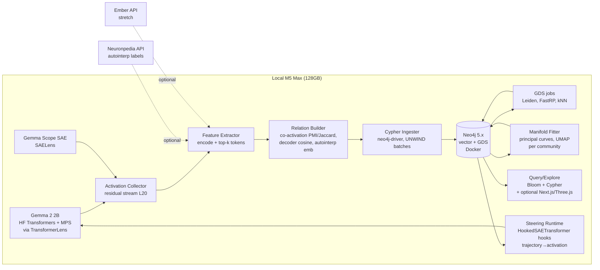

# PRD: **Neograph** — A Neo4j Substrate for Neural Geometry

*A build‑ready spec for a coding agent (Claude Code) to execute against, end‑to‑end, on Theo's M5 Max.*

---

## 0. Executive summary

Goodfire's *The World Inside Neural Networks* (May 7, 2026) lands on a simple, sharp claim: concepts in neural networks live on **curved manifolds**, not straight lines, and SAEs — the reigning interpretability primitive — **shatter** those manifolds into a confetti of locally‑sensible features whose union is the actual structure. Their banner example shows ~23 SAE features ("Words beginning with Hor", "Tokens starting with Por", "Words beginning with Marg", "Boundaries between adjacent XML/HTML tags", and so on) all sitting on a single underlying manifold of **slant rhymes ending in "‑ore"**. Each label is locally true. None of them, alone or as a flat list, tells you the manifold is "phonological endings."

The thesis of this PRD: *that confetti is a graph problem*. Features sit at the leaves; manifolds are mid‑scale subgraphs; circuits are paths; behaviors are attractors. Today's tools (Neuronpedia, SAELens, Ember) treat features as flat lists with ad‑hoc dashboards, and store circuits as JSON blobs that are functionally graphs but never get the benefit of being one. Anthropic's own "attribution graphs" are literally graphs — and yet they live as JSON files behind a React frontend, queried by hand.

**What we're building, in one sentence:** a local Neo4j‑native research substrate that ingests SAE features, activations, and circuits from one open model, builds a multi‑relation feature graph, reconstructs the manifolds the SAEs shattered, and exposes Cypher + a thin UI for querying, intervening, and steering *along trajectories instead of along vectors*.

The wedge is small enough to ship, opinionated enough to matter: **Gemma 2 2B + Gemma Scope, one layer, the rhyme manifold, on a MacBook.**

---

## 1. Background and motivation

### 1.1 What the Goodfire post actually argues

Atticus Geiger, Ekdeep Singh Lubana, Thomas Fel, Jack Merullo, Michael Byun, Owen Lewis, and Tom McGrath open the Neural Geometry series with three claims worth taking seriously:

1. **Concepts live on manifolds, not lines.** The mountain‑car demo is the load‑bearing example: an image‑action world model represents car position as a *curved string* in activation space. Linear steering between two valid car‑positions either teleports the car or produces incoherent garbage; steering along the fitted 1D manifold moves the car smoothly. Quote: *"Even when a model has learned a scalar concept like position, that concept may live on a curved manifold rather than along a straight line in activation space."*

2. **Representation geometry ≈ behavior geometry.** The follow‑up post on days‑of‑the‑week (and the arXiv paper *Manifold Steering Reveals the Shared Geometry of Neural Network Representation and Behavior*, 2605.05115) shows that fitting a 1D manifold to Llama‑3.1 8B's day‑of‑week representations and steering along it cleanly shifts probability mass Mon→Tue→Wed; linear steering produces output distributions that aren't even days of the week. The structure of representation space and the structure of behavior space *are the same shape*.

3. **SAEs shatter manifolds.** This is the cleanest contribution. Their unsupervised pipeline finds a subspace of "‑ore" slant rhymes ("door", "near", "fire", "wire"). The 23 SAE features that reconstruct that subspace each have autointerp labels that are **locally correct and globally useless**: "Words beginning with Hor", "Tokens starting with Por", "Words containing 'or'", "Words beginning with Marg", "Boundaries between adjacent XML/HTML tags". Quote: *"SAE features tend to 'shatter' manifolds into many small and apparently‑unrelated pieces, obscuring the overarching semantic structure that becomes clear when the manifold is viewed as a whole."*

Their concession matters too: *"All models are wrong, but some are useful. SAEs are valuable tools despite their limitations…"* They are not throwing SAEs out. They are saying **SAEs need a layer above them** that recovers the structure SAEs destroyed in the act of decomposing.

### 1.2 Reactions

The X thread on the post drew a predictable shape of community response, plus some signal worth noting. The Goodfire interpretability circle (DeepMind/Anthropic alumni, MATS scholars, Neuronpedia folks) broadly agrees the linear representation hypothesis was always a useful approximation, never the whole story — Engels et al.'s *Not All Language Model Features Are Linear* (NeurIPS 2024) found causally‑relevant circular features for days/months/years in GPT‑2 and Mistral 7B, and Bhalla, Fel, Rager, Lubana et al.'s contemporary *Do Sparse Autoencoders Capture Concept Manifolds?* (arXiv 2604.28119) formalises the shatter mechanism — they call the failure mode *dilution*: SAEs mix a "global subspace" solution and a "local tiling" solution into a fragmented mess, "which explains why manifold structure is rarely visible at the level of individual concepts and motivates **post‑hoc unsupervised discovery methods that search for coherent groups of atoms rather than isolated directions.**"

That sentence is the build‑order for this project.

The pushback: Neel Nanda and the broader DeepMind/MATS interp community don't dispute manifolds — they push back on the framing that SAEs are "wrong." Their position is closer to *"the SAE is the input to your manifold finder, not a competitor."* Michaud, Gorton, McGrath's *Understanding sparse autoencoder scaling in the presence of feature manifolds* (arXiv 2509.02565) suggests SAEs may even try to "tile" manifolds during training and only fail because of L0 pressure killing neighbour latents. Hindupur, Lubana, Fel, Ba's *Projecting Assumptions* paper makes the same point from the other side: every SAE encodes structural assumptions about how concepts are stored, "an SAE does not just reveal concepts — it determines what can be seen at all." LessWrong has chewed on Goodfire's *training‑on‑interpretability* angle separately (the Feb 2026 thread on whether interpretability‑in‑the‑loop is the "most forbidden technique"), but that's orthogonal to the geometry work.

The thing nobody on X has built, that everyone seems to want: **a queryable, multi‑scale store where features, manifolds, circuits, and behaviors are first‑class objects with relationships you can traverse.** Anthropic's attribution graphs come closest, but they ship as JSON + a React viewer.

### 1.3 The gap

Where current tooling sits:

- **Neuronpedia** stores feature dashboards, activations, autointerp explanations, UMAPs, and (since the Anthropic collab) circuit graphs — but the underlying store is a relational DB with vector indexes, not a graph. Cross‑feature queries ("find all features that co‑activate with X *and* sit on a manifold *and* participate in circuit Y") are not first‑class.
- **SAELens** is a programmer's library: `SAE.from_pretrained(...)`, encode/decode, hook on TransformerLens. No structural store.
- **Goodfire Ember** exposes Llama 3.1 8B / 3.3 70B SAE features via API: `client.features.search`, `client.features.inspect`, `client.features.contrast`, plus `AutoConditional` and feature steering. Features are flat objects with `feature_id`, `feature_label`, `index_in_sae`. No manifolds, no graph.
- **Anthropic Circuit Tracer** (open‑sourced June 2025, with PLT and CLT support, replicated by EleutherAI's Attribute and Goodfire's internal CLT graphs) produces beautiful attribution graphs… as JSON. The frontend is React + custom layout. Queries are by‑hand.

What none of them give you: **multi‑scale traversal in one query language.** "Show me the features along manifold M between waypoints w₃ and w₅, only those that participate in circuit C, ranked by their causal effect on token T." That sentence is one Cypher query away if the data lives in Neo4j. Today it's a four‑service Rube Goldberg.

### 1.4 Why Neo4j specifically

- **Native graph** — features ↔ co‑activation, features ↔ manifolds, manifolds ↔ concepts, circuits ↔ features. Joins are free.
- **Vector index** (Neo4j 5.11+, vector‑3.0 provider in 2025.09) — store SAE decoder/encoder directions and autointerp embeddings as `VECTOR` properties; query with `SEARCH n IN ( VECTOR INDEX … FOR query_vector LIMIT k )`.
- **GDS plugin** — Leiden, Louvain, FastRP, Node2Vec, GraphSAGE, kNN graph construction, betweenness, shortest path, all native, all callable from Cypher.
- **Cypher** is the right query language for this. The interpretability community has been writing graph queries in pandas. They shouldn't be.
- **Theo's home turf.** That last point is not a joke — the leverage of building this in the substrate Theo already runs in production at Neo4j is real.

---

## 2. Hypotheses to test

This is a research project, not a feature. Frame everything as falsifiable.

- **H1 (Re‑group).** SAE features that shatter a single semantic manifold can be re‑grouped via Leiden community detection on a multi‑relation graph (co‑activation PMI + decoder cosine + autointerp‑embedding similarity). *Falsifier:* on the rhyme manifold, our communities don't recover the 23 features Goodfire identified at >0.6 NMI.

- **H2 (Reconstruct).** Given a community of features, the underlying 1D/2D manifold can be reconstructed by collecting top‑activating tokens, projecting their residual‑stream activations to low‑dim, and fitting a principal curve. *Falsifier:* the fitted curve's parameterisation does not correlate (Spearman > 0.7) with the ground‑truth concept ordering (e.g. days of week, alphabetical order, rhyme distance).

- **H3 (Steer).** Steering along the reconstructed manifold beats linear steering on coherence (LM log‑prob of in‑distribution next tokens) and target‑hit rate, replicating Goodfire's days‑of‑week result on Gemma 2 2B. *Falsifier:* manifold steering is not measurably better than the matched linear steering vector at p < 0.05.

- **H4 (Circuit‑native).** Storing Anthropic‑style attribution graphs as native Neo4j nodes/edges (rather than JSON) reduces median query latency for typical analyses (shortest causal path, path enumeration with feature‑label filters, motif finding) by ≥10× vs. parsing the JSON each time.

- **H5 (Universality, stretch).** Cross‑model isomorphism: feature graphs for "the same concept" in two different models (Gemma 2 2B vs. GPT‑2 small) match at the *community* level even when individual feature labels don't. Detect via subgraph isomorphism or graph edit distance on autointerp‑embedding‑labelled communities.

- **H6 (Splitting/absorption).** Chanin et al.'s feature absorption pattern (the "S" feature absorbed into "short", "should", etc., per arXiv 2409.14507) shows up in Neo4j as **directed motifs**: a parent feature with high decoder cosine to a cluster of children but anomalously low co‑activation. We can write one Cypher pattern that flags candidate absorptions across all features.

- **H7 (Trajectory > vector).** A *steering trajectory* (a polyline of waypoints along the manifold) traversed during generation produces more semantically continuous outputs than the same trajectory's start‑to‑end steering vector. Measured by sentence‑level embedding smoothness across token positions.

---

## 3. Scope

**IN (P1–P6 below):**

- One model: **Gemma 2 2B base**, residual stream layer 20, `gemma-scope-2b-pt-res-canonical` `width_16k`, average L0 ≈ 71. (Rationale: well‑trodden, SAEs are good and labelled on Neuronpedia, fits comfortably on 128 GB unified memory at fp16, reproducible.)
- One running on Apple Silicon: PyTorch + MPS via TransformerLens for activation capture. MLX is for stretch; the SAE/TransformerLens path is the safe bet.
- One case study: **the rhyme manifold** ("‑ore" slant rhymes), aiming to recover Goodfire's banner figure from SAE features alone.
- A second case study if time: **days of the week** on Gemma 2 2B, replicating the manifold‑steering result.
- A Neo4j 5.x schema with vector indexes + GDS plugin.
- An ingestion pipeline (Python → Cypher batch).
- A query layer (Cypher snippets + a small Python helper).
- A manifold‑reconstruction algorithm (Leiden on multi‑relation graph → principal curve fit).
- A minimal exploration UI: Neo4j Bloom for the MVP; a Next.js + Three.js explorer if the Neo4j dashboard is insufficient.

**OUT (explicitly):**

- Training new SAEs from scratch. Use Gemma Scope.
- Multi‑model comparison in P1–P6 (H5 is stretch).
- Production hosting. Local Docker only.
- UI polish beyond functional. No design work.
- Integration with Goodfire Ember's hosted SAEs initially. We use open Gemma Scope SAEs to avoid licensing/rate‑limit drag. Ember integration is a stretch that the schema supports trivially.
- Image models / world models. The mountain‑car analog is a stretch — text manifolds first.

---

## 4. Architecture

### 4.1 System diagram



### 4.2 Components

- **Model runner:** `transformer_lens.HookedTransformer.from_pretrained("gemma-2-2b", device="mps")`. Fall back to CPU if MPS misbehaves on a specific op (Gemma 2's hybrid attention has had MPS issues; a fallback `device="cpu"` for problem layers is fine for this scale).
- **SAE loader:** SAELens. `from sae_lens import SAE; sae = SAE.from_pretrained(release="gemma-scope-2b-pt-res-canonical", sae_id="layer_20/width_16k/canonical", device="mps")`. d_model = 2304, d_sae = 16384, JumpReLU.
- **Activation collector:** `model.run_with_cache_with_saes(prompts, saes=[sae])` returns feature activations per token per prompt. Batch with HF `datasets`.
- **Feature ingester:** for each SAE feature index 0..16383, compute top‑k tokens (k = 32) by activation, fetch decoder direction (`sae.W_dec[i]`), encoder direction (`sae.W_enc[:, i]`), pull autointerp label from Neuronpedia API (`https://www.neuronpedia.org/api/feature/gemma-2-2b/20-gemmascope-res-16k/{i}`), embed the label with `sentence-transformers/all-MiniLM-L6-v2`.
- **Graph builder:** computes pairwise relations (sparsified to k‑NN per feature on each relation type) and writes weighted edges.
- **Manifold fitter:** runs Leiden on the multi‑relation graph; for each community pulls top‑activating token activations, fits UMAP→principal curve. Stores manifold + waypoints back to Neo4j.
- **Query layer:** Cypher snippets (§8) + a tiny Python wrapper using `neo4j` driver.
- **UI:** Neo4j Bloom for MVP. If a 3D manifold viz is needed, a Next.js + Three.js page that pulls waypoints + features from a thin FastAPI gateway over `neo4j-driver`. Reuse Theo's Cartographer Voronoi/fog‑of‑war aesthetic for the manifold explorer (stretch §12).
- **Orchestration:** pure Python scripts under `scripts/` for ingestion (one shot, idempotent). LangGraph is overkill. If Theo wants an agentic exploration loop later, expose Neo4j as an MCP server (stretch §12).

### 4.3 Stack

| Layer | Choice | Why |
|-------|--------|-----|
| Model | Gemma 2 2B base | Open, small, Gemma Scope SAEs available everywhere |
| Inference | PyTorch + MPS via TransformerLens 2.x | Works today on Apple Silicon; SAELens integrates natively |
| SAEs | Gemma Scope, layer 20, width 16k canonical | Anthropic‑quality JumpReLU, Neuronpedia labels exist |
| Activation extract | TransformerLens `run_with_cache_with_saes` | One‑liner; handles the SAE attach |
| Autointerp | Neuronpedia API + local Claude fallback | Avoid re‑labelling 16k features |
| Embeddings | `sentence-transformers/all-MiniLM-L6-v2` (384‑dim) | Cheap, fast, fits in vector index |
| Manifold fit | UMAP + scikit‑learn or `pyflowline`/principal_curves | Battle‑tested |
| Graph DB | Neo4j 5.x + GDS 2.x + APOC + GenAI plugin (Docker) | Vector index, Leiden, FastRP, all in one |
| Driver | `neo4j` Python (sync), `UNWIND $rows` batch ingest | Standard |
| UI | Neo4j Bloom (MVP) → Next.js + Three.js (stretch) | MVP free; Cartographer reuse for v2 |

---

## 5. Neo4j schema

Concrete. Names and types you can paste into Cypher.

### 5.1 Nodes

```
(:Model {
  id: string,                 // "gemma-2-2b"
  family: string,             // "gemma-2"
  d_model: integer,           // 2304
  n_layers: integer,          // 26
  vocab_size: integer,        // 256000
  source: string              // "google/gemma-2-2b"
})

(:Layer {
  id: string,                 // "gemma-2-2b/L20"
  index: integer,             // 20
  site: string,               // "resid_post"
  hook_name: string           // "blocks.20.hook_resid_post"
})

(:SAE {
  id: string,                 // "gemma-scope-2b-pt-res/L20/16k/canonical"
  release: string,
  sae_id: string,
  d_in: integer,              // 2304
  d_sae: integer,             // 16384
  architecture: string,       // "jumprelu"
  l0_target: float            // 71.0
})

(:SAEFeature {
  id: string,                 // "gemma-2-2b/L20/16k/F10602"
  sae_id: string,
  index: integer,             // 10602
  decoder_vec: VECTOR(2304, FLOAT32),
  encoder_vec: VECTOR(2304, FLOAT32),
  decoder_norm: float,
  activation_density: float,  // fraction of tokens it fires on
  max_act: float,
  is_dead: boolean
})

(:AutoInterpLabel {
  id: string,                 // "{feature_id}#np-claude-haiku"
  source: string,             // "neuronpedia:np_max-act-logits" | "claude-3-5-haiku" | "manual"
  text: string,
  embedding: VECTOR(384, FLOAT32),
  score: float                // when available
})

(:Token {
  id: string,                 // "{vocab_idx}"
  vocab_idx: integer,
  surface: string             // the literal token string
})

(:Prompt {
  id: string,                 // sha1 of the prompt
  text: string,
  source: string,             // "pile" | "synthetic-rhymes" | "synthetic-weekdays"
  n_tokens: integer
})

(:Activation {
  // Created sparsely — only when a feature fires above threshold on a token in a prompt.
  // Heavy node. Index aggressively. Optional in P2; required in P4.
  id: string,                 // "{prompt_id}:{pos}:{feature_id}"
  position: integer,
  magnitude: float
})

(:Manifold {
  id: string,                 // "rhyme-ore-L20"
  layer_id: string,
  intrinsic_dim: integer,     // 1, 2, ...
  method: string,             // "leiden+principal_curve" | "umap+spline"
  n_waypoints: integer,
  arc_length: float,
  fit_residual: float,
  notes: string
})

(:Waypoint {
  id: string,                 // "{manifold_id}/w{i}"
  index: integer,             // 0..n
  arc_position: float,        // 0.0..1.0
  centroid: VECTOR(2304, FLOAT32),
  tangent: VECTOR(2304, FLOAT32)
})

(:Circuit {
  id: string,                 // "circuit/{prompt_hash}/{target_token}"
  prompt_id: string,
  target_token: string,
  pruning_threshold: float,
  source: string              // "circuit-tracer-PLT" | "circuit-tracer-CLT" | "manual"
})

(:Concept {
  id: string,                 // "rhyme:-ore"
  name: string,
  description: string,
  taxonomy: string            // "phonological" | "temporal" | "spatial" | ...
})
```

### 5.2 Relationships

```
(SAE)-[:DECOMPOSES]->(Layer)
(SAEFeature)-[:LIVES_IN {position: integer}]->(Layer)
(SAEFeature)-[:DEFINED_BY]->(SAE)
(SAEFeature)-[:LABELED_AS {primary: boolean}]->(AutoInterpLabel)

(Token)-[:ACTIVATES {magnitude: float, prompt_id: string, position: integer}]->(SAEFeature)
// Use Activation nodes for full provenance; this rel is the aggregated form.

(SAEFeature)-[:CO_ACTIVATES_WITH {
  pmi: float, jaccard: float,
  cosine_decoder: float,
  cosine_label: float,
  n_co: integer, n_a: integer, n_b: integer
}]->(SAEFeature)
// Symmetric in semantics, stored as one-directional pair (lower index → higher index).

(SAEFeature)-[:DECODER_SIMILAR {cosine: float}]->(SAEFeature)
// Sparsified k-NN, k = 32

(SAEFeature)-[:LABEL_SIMILAR {cosine: float}]->(SAEFeature)
// Sparsified k-NN on autointerp embedding, k = 32

(SAEFeature)-[:LIES_ON {
  closest_waypoint: integer,
  perp_distance: float,
  arc_position: float
}]->(Manifold)

(Waypoint)-[:NEXT {arc_delta: float}]->(Waypoint)
(Manifold)-[:HAS_WAYPOINT]->(Waypoint)
(Manifold)-[:DESCRIBES {confidence: float}]->(Concept)

(Circuit)-[:INCLUDES {role: string, attribution: float}]->(SAEFeature)
(SAEFeature)-[:CAUSES {
  effect_size: float,
  method: string,        // "patching" | "attribution" | "transcoder-edge"
  prompt_id: string
}]->(SAEFeature)

(Concept)-[:HIERARCHY {kind: string}]->(Concept)
// for parent/child or related concepts

(SAEFeature)-[:ABSORBED_BY {evidence: float}]->(SAEFeature)
// candidate feature-absorption motif (Chanin et al. 2024)
```

### 5.3 Indexes / constraints

```cypher
// Uniqueness
CREATE CONSTRAINT model_id IF NOT EXISTS FOR (m:Model) REQUIRE m.id IS UNIQUE;
CREATE CONSTRAINT layer_id IF NOT EXISTS FOR (l:Layer) REQUIRE l.id IS UNIQUE;
CREATE CONSTRAINT sae_id IF NOT EXISTS FOR (s:SAE) REQUIRE s.id IS UNIQUE;
CREATE CONSTRAINT feat_id IF NOT EXISTS FOR (f:SAEFeature) REQUIRE f.id IS UNIQUE;
CREATE CONSTRAINT label_id IF NOT EXISTS FOR (a:AutoInterpLabel) REQUIRE a.id IS UNIQUE;
CREATE CONSTRAINT prompt_id IF NOT EXISTS FOR (p:Prompt) REQUIRE p.id IS UNIQUE;
CREATE CONSTRAINT manifold_id IF NOT EXISTS FOR (m:Manifold) REQUIRE m.id IS UNIQUE;
CREATE CONSTRAINT wp_id IF NOT EXISTS FOR (w:Waypoint) REQUIRE w.id IS UNIQUE;
CREATE CONSTRAINT circuit_id IF NOT EXISTS FOR (c:Circuit) REQUIRE c.id IS UNIQUE;

// Range indexes
CREATE INDEX feat_layer IF NOT EXISTS FOR (f:SAEFeature) ON (f.sae_id);
CREATE INDEX feat_index IF NOT EXISTS FOR (f:SAEFeature) ON (f.index);

// Vector indexes (Cypher 5 / Neo4j 5.x syntax)
CREATE VECTOR INDEX feat_decoder IF NOT EXISTS
  FOR (f:SAEFeature) ON (f.decoder_vec)
  OPTIONS {indexConfig: { `vector.dimensions`: 2304, `vector.similarity_function`: 'cosine' }};

CREATE VECTOR INDEX feat_encoder IF NOT EXISTS
  FOR (f:SAEFeature) ON (f.encoder_vec)
  OPTIONS {indexConfig: { `vector.dimensions`: 2304, `vector.similarity_function`: 'cosine' }};

CREATE VECTOR INDEX label_emb IF NOT EXISTS
  FOR (a:AutoInterpLabel) ON (a.embedding)
  OPTIONS {indexConfig: { `vector.dimensions`: 384, `vector.similarity_function`: 'cosine' }};

CREATE VECTOR INDEX waypoint_centroid IF NOT EXISTS
  FOR (w:Waypoint) ON (w.centroid)
  OPTIONS {indexConfig: { `vector.dimensions`: 2304, `vector.similarity_function`: 'cosine' }};
```

A note on size: 16 384 features × 2304 floats × 2 (encoder + decoder) × 4 bytes = ~300 MB of vectors. Plus edges. Plus activations if you store them per‑token. Comfortably under 10 GB total for the canonical layer. Neo4j handles this without breaking a sweat. Scaling to all 26 layers ≈ 10× → 100 GB; still local.

---

## 6. Ingestion pipeline

A coding agent should produce six scripts, callable individually, idempotent, with clear progress logs. Suggested layout:

```
neograph/
  pyproject.toml
  scripts/
    00_bootstrap_neo4j.sh        # docker compose up; install GDS+APOC
    01_load_model_and_sae.py     # smoke test: load Gemma 2 2B + SAE on MPS
    02_seed_corpus.py            # build prompts: pile slice + rhyme synth + weekday synth
    03_capture_activations.py    # run model+SAE, write Activation rows + top-k tokens per feature
    04_ingest_features.py        # write SAEFeature, AutoInterpLabel, decoder/encoder vectors
    05_build_relations.py        # CO_ACTIVATES_WITH, DECODER_SIMILAR, LABEL_SIMILAR
    06_communities_and_manifolds.py  # Leiden + UMAP + principal curve fit
    07_eval_steering.py          # P6 trajectory steering experiment
  src/neograph/
    cypher.py
    activations.py
    relations.py
    manifold.py
    steering.py
```

### 6.1 Steps in detail

1. **Boot Neo4j.** Docker compose: `neo4j:5.26-enterprise` with `NEO4J_PLUGINS='["graph-data-science","apoc","genai"]'`, vector index enabled by default, GDS heap ≥ 16 GB.

2. **Load Gemma 2 2B + SAE.** As §4.3. Sanity: forward pass on "The capital of France is", confirm `Paris` is top‑1 and that `model.run_with_cache_with_saes(prompts, saes=[sae])` returns feature activations of shape `(batch, seq, 16384)`.

3. **Build the corpus.**
   - **Pile slice** (`monology/pile-uncopyrighted`): 10k passages, 128 tokens each. This matches what the SAE was trained on and gives broad activation coverage.
   - **Rhyme synthesis:** 1k synthetic prompts of the form `"The word that rhymes with door is "` over a curated list of ~200 ‑ore slant rhymes (door, more, fire, higher, near, dear, war, four, before, store, ore, shore, oar, wire, hire, mire, wore, score, bore, lore, …). This is the targeted probe for the rhyme manifold.
   - **Weekdays synthesis:** 500 prompts of the Engels‑style `"Let's do some day of the week math. Two days from Monday is "` and `"What day comes 5 days after Sunday?"`. For H3.

4. **Capture activations.** For each prompt, run model+SAE; for each (prompt, position) collect feature activations. Write:
   - Per feature: `top_k_tokens` = top 32 (token, prompt, position, magnitude) tuples; `activation_density` = fraction of token positions where feature fires above 1e‑3.
   - Optional: full `Activation` nodes only for the rhyme/weekday synthetic prompts (otherwise data explodes). For Pile prompts, store aggregates only.
   - Use `pickle`/`parquet` as a staging format before Cypher ingestion; Neo4j ingestion is the slow part.

5. **Ingest features.** Batched `UNWIND $rows AS row CREATE (f:SAEFeature {…})` in batches of 1000. Set `decoder_vec` via `db.create.setNodeVectorProperty(f, 'decoder_vec', row.decoder)` (or directly as a `LIST<FLOAT>` then convert). For each feature, if Neuronpedia has a label (`https://www.neuronpedia.org/api/feature/gemma-2-2b/20-gemmascope-res-16k/{i}`), use it; else fall back to a local Claude Haiku call given top‑k activations. Embed every label with MiniLM and write `AutoInterpLabel` + `:LABELED_AS`.

6. **Compute relations.**
   - **Co‑activation:** for every pair `(i,j)` of features that *both* fire on at least one shared token position in the corpus, compute `pmi(i,j) = log P(i,j)/(P(i)P(j))` and `jaccard = |A∩B|/|A∪B|` over token positions. Sparsify to top‑32 highest‑PMI neighbours per feature.
   - **Decoder cosine:** all‑pairs cosine on `W_dec` is 16384² ≈ 268M pairs at fp32; doable but 1 GB. Use FAISS or torch on MPS to compute, then keep only top‑32 per feature.
   - **Label cosine:** top‑32 nearest neighbours via the Neo4j vector index over `AutoInterpLabel.embedding`.
   - Write all three as separate edge types so downstream queries can filter.

7. **(Optional, heavy) Activation nodes.** Only for the synthetic rhyme/weekday prompts. ~1k prompts × 128 tokens × ~70 active features = ~9M activation rows; Neo4j can do this but ingest carefully (`UNWIND` batches of 5k, periodic transaction commits via `apoc.periodic.iterate`).

---

## 7. Manifold reconstruction algorithm

This is the heart of the project — H1 + H2.

### 7.1 Pipeline

1. **Project the multi‑relation graph.** GDS Cypher projection that combines three edge types with weights:
   ```cypher
   CALL gds.graph.project.cypher(
     'feature-multi-graph',
     'MATCH (f:SAEFeature {sae_id: $sae_id}) RETURN id(f) AS id',
     '
       MATCH (a:SAEFeature)-[r:CO_ACTIVATES_WITH]->(b:SAEFeature)
       WHERE a.sae_id = $sae_id RETURN id(a) AS source, id(b) AS target,
         (0.5 * r.pmi/$pmi_max + 0.3 * r.cosine_decoder + 0.2 * r.cosine_label) AS weight
       UNION ALL
       MATCH (a:SAEFeature)-[r:DECODER_SIMILAR]->(b:SAEFeature)
       WHERE a.sae_id = $sae_id RETURN id(a) AS source, id(b) AS target, 0.3 * r.cosine AS weight
       UNION ALL
       MATCH (a:SAEFeature)-[r:LABEL_SIMILAR]->(b:SAEFeature)
       WHERE a.sae_id = $sae_id RETURN id(a) AS source, id(b) AS target, 0.2 * r.cosine AS weight
     ',
     {parameters: {sae_id: 'gemma-scope-2b-pt-res/L20/16k/canonical', pmi_max: 10.0}}
   );
   ```
   Tune the weighting once we see what dominates.

2. **Leiden community detection.**
   ```cypher
   CALL gds.leiden.write('feature-multi-graph', {
     writeProperty: 'communityId',
     gamma: 1.0, theta: 0.01, randomSeed: 42,
     relationshipWeightProperty: 'weight'
   }) YIELD communityCount, modularity, modularities;
   ```
   Expect 200–800 communities for 16k features. Sanity‑check sizes: very large communities (>200) are likely noise edges that need re‑weighting; very small (singletons) are dead features.

3. **Per community, fit a manifold.**
   - Pull all `Activation`s for features in the community on the synthetic corpus (this is why we kept full activations for synthetics).
   - For each (token, position) where any community feature fires: extract the residual‑stream activation `h ∈ R^2304` *at that position from the original prompt run* (re‑run if not cached).
   - PCA → 16 dims; UMAP → 2–3 dims for visualization, but keep the 16D for fitting.
   - Fit a **principal curve** (Hastie‑Stuetzle, or Kégl polygonal line, or a smoothing‑spline variant — `pcurvepy` or `principal_curves` Python package). Choose 1D unless the residual after a 1D fit is high (>30% unexplained variance), in which case allow a 2D principal surface.
   - Sample N = 16 waypoints uniformly along arc length. Each waypoint stores its **centroid in original 2304D activation space** (project back from the low‑dim fit using the inverse PCA + the principal curve's natural inverse) and a **tangent vector** (numerical derivative along arc).

4. **Write the manifold back.**
   ```cypher
   MERGE (m:Manifold {id: $manifold_id})
     SET m.layer_id = $layer_id, m.method = 'leiden+principal_curve',
         m.intrinsic_dim = 1, m.n_waypoints = size($waypoints),
         m.arc_length = $arc_len, m.fit_residual = $resid;
   WITH m
   UNWIND range(0, size($waypoints)-1) AS i
   WITH m, i, $waypoints[i] AS w
   MERGE (wp:Waypoint {id: m.id + '/w' + toString(i)})
     SET wp.index = i, wp.arc_position = w.arc, wp.centroid = w.centroid, wp.tangent = w.tangent
   MERGE (m)-[:HAS_WAYPOINT]->(wp);
   // chain NEXT
   MATCH (m:Manifold {id: $manifold_id})-[:HAS_WAYPOINT]->(wp:Waypoint)
   WITH m, wp ORDER BY wp.index
   WITH m, collect(wp) AS wps
   UNWIND range(0, size(wps)-2) AS i
   WITH wps[i] AS a, wps[i+1] AS b
   MERGE (a)-[:NEXT {arc_delta: b.arc_position - a.arc_position}]->(b);
   ```

5. **Project features onto the manifold.** For each community feature, compute closest waypoint by cosine to centroid; write `:LIES_ON {closest_waypoint, perp_distance, arc_position}`.

6. **Concept assignment (optional, for legibility).** Embed manifold's representative tokens via MiniLM, find nearest `Concept` node by label cosine; if none, create a draft `Concept` and ask Claude to summarise the union of feature autointerp labels (this is the "what manifold am I looking at?" answer).

---

## 8. Query patterns and interventions

The point of putting this in Neo4j is that the right questions become one‑liners.

```cypher
// Q1. Find all features that lie on the same manifold as feature F10602 but in a different Leiden community.
MATCH (f:SAEFeature {index: 10602, sae_id: $sae})-[:LIES_ON]->(m:Manifold)
MATCH (g:SAEFeature)-[:LIES_ON]->(m)
WHERE g.communityId <> f.communityId
RETURN g.index, g.communityId, g.activation_density
ORDER BY g.activation_density DESC LIMIT 50;

// Q2. Shortest causal path between two features across layers (uses CAUSES edges from circuit-tracer ingest).
MATCH (a:SAEFeature {index: $a_idx}), (b:SAEFeature {index: $b_idx})
MATCH p = shortestPath((a)-[:CAUSES*..6]->(b))
RETURN [n IN nodes(p) | n.index] AS path, [r IN relationships(p) | r.effect_size] AS effects;

// Q3. Detect candidate "shattered" manifolds — Leiden communities whose autointerp labels are
//     textually unrelated (low pairwise label cosine) but high decoder + co-activation similarity.
MATCH (f:SAEFeature)-[:LABELED_AS {primary: true}]->(a:AutoInterpLabel)
WITH f.communityId AS cid, collect(f) AS feats, collect(a.embedding) AS embs
WHERE size(feats) >= 5
WITH cid, feats, embs,
     // mean pairwise label cosine
     reduce(s = 0.0, i IN range(0, size(embs)-2) |
       s + reduce(s2 = 0.0, j IN range(i+1, size(embs)-1) |
         s2 + vector.similarity.cosine(embs[i], embs[j]))) AS label_sum,
     size(embs) * (size(embs)-1) / 2.0 AS n_pairs
WITH cid, feats, label_sum / n_pairs AS mean_label_cos
WHERE mean_label_cos < 0.25
// now verify decoder + co-activation are tight
MATCH (a:SAEFeature)-[r:CO_ACTIVATES_WITH]->(b:SAEFeature)
WHERE a.communityId = cid AND b.communityId = cid
WITH cid, mean_label_cos, avg(r.pmi) AS mean_pmi, avg(r.cosine_decoder) AS mean_dec
WHERE mean_pmi > 2.0 AND mean_dec > 0.4
RETURN cid, mean_label_cos, mean_pmi, mean_dec
ORDER BY (mean_pmi + mean_dec) - mean_label_cos DESC LIMIT 20;

// Q4. Pull manifold waypoints in order to construct a steering trajectory.
MATCH (m:Manifold {id: $manifold_id})-[:HAS_WAYPOINT]->(w:Waypoint)
RETURN w.index, w.arc_position, w.centroid, w.tangent
ORDER BY w.index;

// Q5. For a target token, find features that activate on it and lie on a manifold related to a concept.
MATCH (t:Token {surface: 'fire'})-[a:ACTIVATES]->(f:SAEFeature)-[:LIES_ON]->(m:Manifold)-[:DESCRIBES]->(c:Concept)
WHERE c.taxonomy = 'phonological'
RETURN c.name, m.id, f.index, a.magnitude
ORDER BY a.magnitude DESC LIMIT 20;

// Q6. Candidate feature absorption motif (Chanin et al. pattern).
//     Parent feature has high decoder cosine to a children-cluster, but low co-activation overlap.
MATCH (parent:SAEFeature)-[d:DECODER_SIMILAR]->(child:SAEFeature)
WHERE d.cosine > 0.6
OPTIONAL MATCH (parent)-[c:CO_ACTIVATES_WITH]->(child)
WITH parent, child, d.cosine AS dec_sim, coalesce(c.jaccard, 0.0) AS jac
WHERE dec_sim > 0.6 AND jac < 0.05
MERGE (parent)-[r:ABSORBED_BY {evidence: dec_sim - jac}]->(child);
```

### 8.1 Steering interventions

A steering trajectory is just a list of waypoint centroids. The runtime hook in TransformerLens:

```python
def manifold_steer_hook(activations, hook, traj, alpha, t_step):
    # activations: (batch, seq, d_model)
    # traj: tensor (n_wp, d_model)
    target = traj[t_step]
    activations[:, -1, :] = activations[:, -1, :] + alpha * (target - activations[:, -1, :])
    return activations

model.add_hook("blocks.20.hook_resid_post", partial(manifold_steer_hook, traj=traj, alpha=0.7, t_step=t))
```

For each generation step `t` we advance to the next waypoint. The result is a *trajectory steer*, not a vector steer — what Goodfire showed in their weekday demo. Compare against the linear vector `traj[-1] - traj[0]` baseline.

---

## 9. Evaluation

### 9.1 Replicate Goodfire's rhyme example

Target metric: **community recovery NMI ≥ 0.6** vs. the 23 features Goodfire listed (treating their list as one community and the rest of the SAE as background). Specific Goodfire feature indices to anchor against (from their post): 2478, 3596, 4583, 4596, 4806, 5316, 6440, 7471, 9514, 10637, 12145, 12714, 17398, 20283, 21241, 22084, 23104, 23118, 24140, 25233, 28555, 31648, 31747. Note these are from a **width 32k+** SAE (their indices go to 31747); we'll use width‑16k canonical and accept that we may recover a coarser community. For width 65k Gemma Scope SAEs the indices match more directly — keep that as a stretch ablation.

### 9.2 Replicate the days‑of‑week steering result

Use Engels et al.'s evaluation harness (`MultiDimensionalFeatures` GitHub repo) on Gemma 2 2B. Metrics:

- **Linear steering baseline:** generate `"What day comes after Monday? "`, apply steering vector `mean(activations on "Friday") − mean(activations on "Monday")` at L20, measure log P(Tue|prompt+steer) → log P(Sat|prompt+steer).
- **Manifold trajectory steering:** apply our 7‑waypoint cyclic manifold; measure same.
- **Coherence:** average log P over all next‑token candidates that are days‑of‑week tokens. A coherent steer should put 100% mass on day tokens.
- **Target‑hit rate:** for steering Mon→Wed, what fraction of generations actually output "Wednesday"?

Target: manifold steering ≥ 1.5× target‑hit rate of linear, and ≥ 0.2 nat lower entropy on the next‑day distribution.

### 9.3 Ablations

- **Edge‑type ablation:** rebuild the feature graph with (a) only co‑activation, (b) only decoder cosine, (c) only label cosine, (d) all three. Compare community modularity and rhyme‑recovery NMI across configurations.
- **Random graph baseline:** wire the same nodes with random edges of matching density; communities should be near‑random and rhyme‑recovery NMI ≈ 0.
- **Sparsity sweep:** kNN k ∈ {8, 16, 32, 64, 128}; pick the inflection point.

### 9.4 Latency / scale checks

- Time `02_seed_corpus.py` end‑to‑end (target < 30 min on M5 Max).
- Time activation capture for 11.5k prompts (target < 4 hrs).
- Time pairwise decoder cosine on 16k × 16k (target < 5 min using torch on MPS).
- Time Leiden on the full graph (target < 2 min via GDS).
- Per‑manifold fit: target < 30 s.
- Q1–Q6 latency: target < 200 ms each on cold cache, < 50 ms warm.

---

## 10. Phased build plan

Six phases, each ending with something runnable. Each phase scope is opinionated about cuts; the agent should not silently expand them.

### P1 — Foundation (≈8 agent‑loops)

- **Scope:** Local Neo4j 5.x in Docker with GDS + APOC + GenAI; Python env with PyTorch/MPS, TransformerLens, SAELens, sentence‑transformers, `neo4j` driver.
- **Deliverables:** `00_bootstrap_neo4j.sh`, `01_load_model_and_sae.py`, smoke‑test notebook showing Gemma 2 2B + Gemma Scope SAE forward pass on MPS, top‑10 active features for the prompt "The capital of France is Paris."
- **Exit criteria:** `python scripts/01_load_model_and_sae.py` prints feature activations and confirms `cypher-shell` can connect.

### P2 — Feature ingestion (≈10 loops)

- **Scope:** Pile slice corpus, run model+SAE, write Model/Layer/SAE/SAEFeature/AutoInterpLabel nodes for layer 20 width‑16k. Pull autointerp labels from Neuronpedia API; fallback to local Claude Haiku via Anthropic SDK for missing/empty. Vector indexes created and populated.
- **Deliverables:** `02_seed_corpus.py`, `03_capture_activations.py`, `04_ingest_features.py`. Cypher `:schema` returns expected indexes/constraints.
- **Exit criteria:** `MATCH (f:SAEFeature) RETURN count(f)` returns 16384. `SEARCH f IN (VECTOR INDEX feat_decoder FOR <random vector> LIMIT 5)` returns sensible neighbours for at least 3 spot‑checked features.

### P3 — Multi‑relation graph + first communities (≈12 loops)

- **Scope:** Co‑activation PMI/Jaccard, decoder cosine, label cosine; sparsify to k=32 each; ingest as three edge types. GDS projection + Leiden. Persist `communityId` on features.
- **Deliverables:** `05_build_relations.py`, `06_communities_and_manifolds.py` (Leiden half). A first‑pass dashboard in Bloom showing the largest 20 communities with their representative autointerp labels.
- **Exit criteria:** Edge counts within expected order (16384 × 32 × 3 ≈ 1.5 M edges). Leiden modularity > 0.5. The "Words/tokens starting with X" cluster of features is one or two coherent Leiden communities.

### P4 — Rhyme manifold reconstruction (≈12 loops)

- **Scope:** Synthetic rhyme corpus, full Activation rows for it, principal‑curve fit per community, Manifold + Waypoint nodes written, features projected to closest waypoint.
- **Deliverables:** `06_communities_and_manifolds.py` complete; the rhyme manifold materialised and queryable. Q1 and Q4 working.
- **Exit criteria:** Q3 (Cypher motif for shattered manifolds) returns the rhyme community. NMI vs. Goodfire's 23 features ≥ 0.5 (allowing for width‑16k vs. width‑32k mismatch).

### P5 — Query layer + UI (≈8 loops)

- **Scope:** A `src/neograph/cypher.py` Python helper exposing Q1–Q6 as functions returning pandas DataFrames; a Bloom perspective with sane styling; *optional* Next.js + Three.js page rendering one selected manifold's waypoints + features in 3D (PCA‑projected).
- **Deliverables:** `cypher.py`, `bloom-perspective.json`, optional `apps/explorer/`.
- **Exit criteria:** Theo can sit down with the Bloom perspective and answer "show me the ‑ore rhyme manifold" by clicking, not by typing Cypher. (Cypher still works, of course.)

### P6 — Steering experiment (≈10 loops)

- **Scope:** Days‑of‑week corpus, manifold reconstruction for the weekday community, trajectory steering vs. linear steering baseline. A `07_eval_steering.py` script that reports the target metrics from §9.2.
- **Deliverables:** `steering.py` runtime, `07_eval_steering.py` with json + matplotlib report.
- **Exit criteria:** Manifold trajectory steering measurably beats linear on coherence and target‑hit rate, replicating Goodfire's qualitative result on Gemma 2 2B. If it doesn't, we have a graphable, debuggable failure to write up.

Total agent‑loop budget: **~60**. Realistic on Theo's setup with Claude Code; aggressive but not insane.

---

## 11. Risks and open questions

- **SAE‑only data may be insufficient to recover manifolds.** Goodfire is explicit: their unsupervised pipeline needed *both* SAE features *and* raw activations. Our P4 plan uses raw activations on the synthetic corpus precisely for this reason. If communities are good but per‑community manifold fits are poor, we've localised the failure to manifold fitting, not graph construction — a clean result either way. Also relevant: Bhalla et al.'s *dilution* result (arXiv 2604.28119) suggests SAE manifold capture is **fragmented by design** at typical widths; running our pipeline on Gemma Scope width‑65k could materially help.
- **Graph blow‑up.** 16384 features × 32 neighbours × 3 edge types ≈ 1.5 M edges. Fine. But scaling to all 26 layers × all sites (resid/MLP/attn) ≈ 100× → 150 M edges. Neo4j scales fine but Leiden on a 16M‑node graph is several minutes; budget accordingly. Use GDS estimate procs (`gds.leiden.write.estimate`) before each run.
- **Apple Silicon edge cases.** Gemma 2's hybrid local/global attention has hit MPS bugs in TransformerLens historically; have the agent verify forward‑pass parity vs. CPU on a fixed prompt before doing 11k prompts. If MPS can't do the SAE encode (it should — JumpReLU is straightforward), fall back to CPU for the encode step only; Gemma 2 2B activations are 2304×128×batch, easily moved.
- **Novelty / prior art.** Closest prior art:
  - **neuPrint** (Janelia connectomics) is Neo4j‑native for *biological* circuits, not artificial. It's the existence proof that a graph DB is the right substrate for "circuits + features + spatial structure"; nothing equivalent exists for artificial nets.
  - Owen Parsons's "Exploring Feature Co‑Occurrence Networks with SAEs" (an AI Alignment course final project) builds co‑occurrence networks but in pandas/networkx, not a queryable store.
  - Anthropic's circuit tracer + Neuronpedia's circuit viewer are the most production‑ready graph view of circuits, but they store JSON and render with React, not a graph DB.
  - I can find no published Neo4j‑hosted SAE feature graph. **The white space is real.**
- **Goodfire Ember vs. open SAEs.** Ember's open‑source SAEs (Llama 3.1 8B layer 19, Llama 3.3 70B layer 50) work great via SDK but tie us to two specific layers and to Goodfire's licensing. Gemma Scope is fully open under CC‑BY‑4.0. We choose Gemma. Adding Ember is one ingester away (`client.features.search` returns features with labels and indices; map to `SAEFeature` directly).
- **Causality is hard.** P4/P5 don't yet require `:CAUSES` edges. If we add them in P6 by integrating circuit‑tracer outputs (PLT or CLT JSON → Neo4j), that's a separate ingester. Acknowledge that today's `:CAUSES` will be sparse unless we wire circuit‑tracer.
- **Evaluation is qualitative on the rhyme side.** Without a public ground‑truth label set ("these 23 features form the ‑ore rhyme manifold"), reproducing Goodfire's exact figure is a soft target. We can hard‑target the days‑of‑week experiment (Engels et al. shipped code).

---

## 12. Stretch ideas

- **Cross‑model graph alignment.** Build the same schema for GPT‑2 small + SAELens RES‑JB SAEs, then run subgraph isomorphism on label‑embedding‑coloured communities to test feature universality (H5). Even modest matches would be a real result and a paper.
- **Neural Geometry MCP server.** Wrap the Cypher helpers as an MCP server. Now Claude Code (the local one Theo is already running) can ask, in natural language, "find features that fire on rhymes but lie on different manifolds in different layers", and have an agent compose Cypher. This is the natural Theo‑voice play: graphs + agents.
- **Cartographer Web tie‑in.** The manifold explorer's UI is the place to reuse Cartographer's Voronoi + fog‑of‑war language. Each Leiden community is a region; each manifold is a road through it; the unexplored parts of the SAE (dead features, high‑entropy regions) are fog. Same visual language, new dataset. Three.js for the 3D principal curve, fragment shader for fog.
- **A "shatter index" per SAE.** For every Gemma Scope SAE (all layers × all sites × all widths), compute the rate of shattered manifolds via the Q3 motif. Publish as a leaderboard. This is genuinely novel and has the kind of *concrete number* that gets cited.
- **Goodfire collaboration angle.** Theo runs customer advocacy at Neo4j. The natural pitch is: *"Goodfire researchers should not be writing pandas. They should be writing Cypher."* Offer to host a Neo4j AuraDB instance pre‑loaded with Gemma Scope graphs as a community resource, sponsored by Neo4j, co‑branded with Goodfire. The Bhalla/Lubana et al. paper *Do Sparse Autoencoders Capture Concept Manifolds?* explicitly motivates "post‑hoc unsupervised discovery methods that search for coherent groups of atoms rather than isolated directions" — we are building exactly that infrastructure. The phone call writes itself.
- **A "manifold of manifolds."** Once you have hundreds of manifolds across layers, embed each manifold (as a sequence of waypoint centroids) and build a graph of manifolds. Are there higher‑order structures — manifolds that compose? This is genuinely uncharted.
- **Cloudflare deployment.** Theo runs Cloudflare. A read‑only mirror of the graph (via Neo4j query API) fronted by a Cloudflare Worker means the manifold explorer can be a public artefact without exposing the local DB. Stretch on the deploy side, not the science.

---

### Closing note for the agent

Build narrowly, ship P1→P6 in order, do not let scope creep into "let's also do circuit tracer ingestion in P3." The interesting science is in **whether the multi‑relation graph + Leiden actually recovers the rhyme manifold from SAE features alone**, and **whether trajectory steering beats vector steering on weekdays in Gemma 2 2B**. Those are the two falsifiable nuggets. Everything else is scaffolding for those two experiments. Write the scaffolding well, but don't fall in love with it.

The wedge is: SAEs shatter, graphs reassemble. Now go build it.