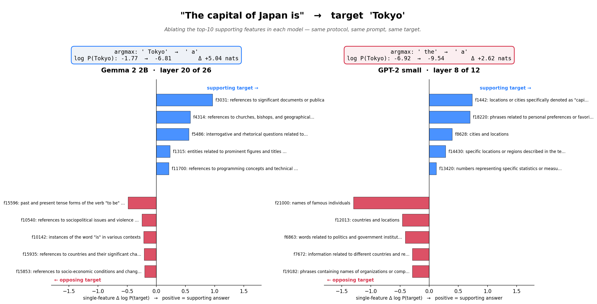
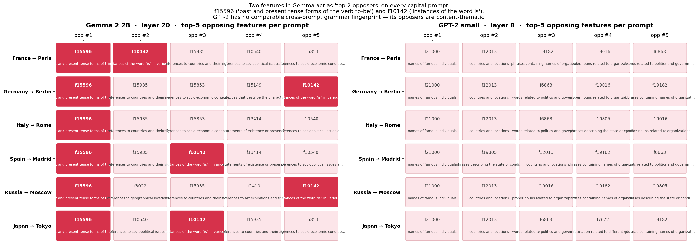
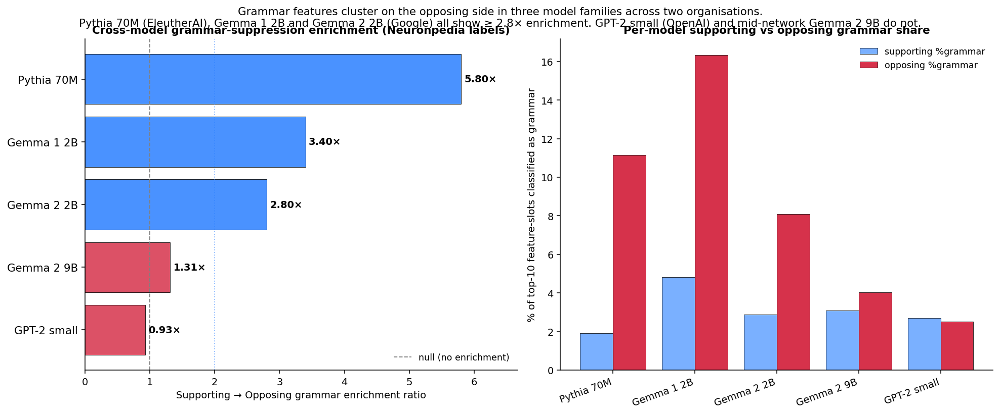
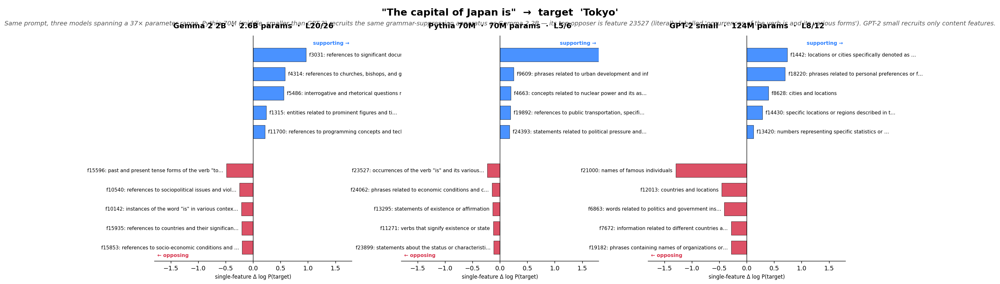
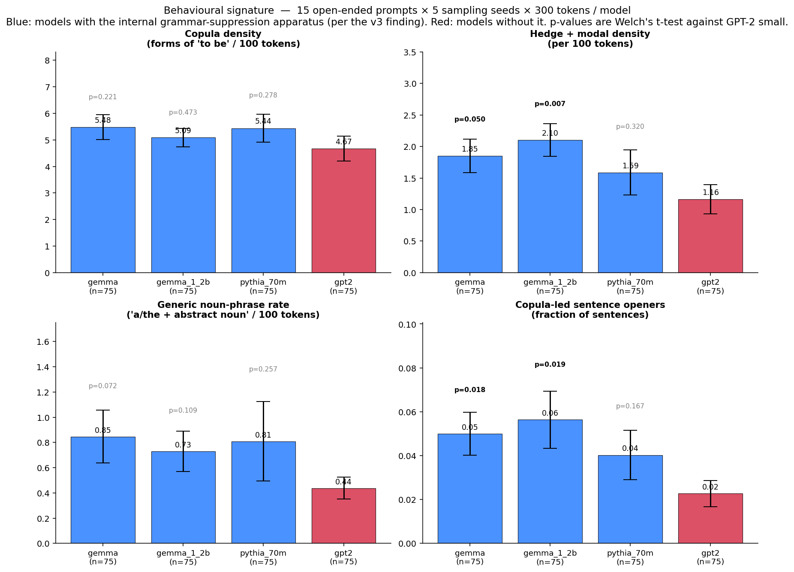

# grammar-layer

> Amplify one SAE feature in Gemma 2 2B labelled "forms of the verb 'to be'" by ten times, and on every capital-completion prompt the argmax flips to **" not"**. Not "a". Not "the". "not". The same dial in Gemma 2 9B (at the depth-matched layer L31), Gemma 1 2B, and Pythia 70M drives log P(target) down monotonically too — they all converge to generic "a" instead. The suppression apparatus is cross-family (four models, three families, 130× parameter range). The negation attractor is Gemma 2 2B alone.

---

## The headline experiment

Take Gemma 2 2B. Ask it *"The capital of Japan is __"*. It says *Tokyo*.

Now find the SAE feature in its residual stream at layer 20 that most strongly opposes the target — feature 15596, labelled by Neuronpedia as *"past and present tense forms of the verb 'to be' in various contexts"*. Multiply its activation at the last position by ten. The argmax does not stay on Tokyo, and it does not drift to "a" or "the". On all six capital-completion prompts in our benchmark — France, Germany, Italy, Spain, Russia, Japan — it flips to **" not"**. Six different correct answers, one feature whose amplification turns each of them into denial.

Most of what we call hedging in language models is the model fighting itself. We knew that. What we didn't know: turn the dial up on the right grammar feature in Gemma 2 2B, and the fight resolves toward " not".

The same protocol on Gemma 2 9B at layer 31 (feature 6341, "instances of the verb 'is' and its variations"), Gemma 1 2B (feature 5541, "instances of the verb 'is'"), and Pythia 70M (feature 23527, "occurrences of the verb 'is' and its various forms") shows the same monotone collapse of target probability, but the argmax converges to a generic *" a"*, not negation. GPT-2 small has 652 grammar-labelled features in its SAE and recruits none of them as opposers on these prompts — the apparatus we are pointing the dial at simply isn't in its prediction routing for these completions.

This is what we found.

---

## What we looked at, in plain English

Modern interpretability lets us read out, at any given moment, which *internal concepts* a language model is using to make a prediction. A technique called a **sparse autoencoder** (SAE) decomposes the model's hidden state into a dictionary of named features — things like *"references to geographical locations"*, *"words related to politics"*, *"forms of the verb 'to be'"*. We can read which of these features are firing for a given prompt, and we can *silence* specific ones and watch what happens to the prediction.

The labels for each SAE feature come from public services like Neuronpedia that have catalogued millions of these concepts. We didn't make them up.

---

## What's lighting up inside each model when Gemma says "Tokyo"

For the prompt *"The capital of Japan is"*, we ranked every active feature in each model by how much its ablation reduces the probability of the correct answer ("Tokyo"). The top-5 features pushing **for** the answer (blue) and the top-5 pushing **against** it (red), side by side:



The numbers in the blue boxes at the top: for Gemma, baseline log P("Tokyo") = −1.77 (≈ 17% probability) — the correct argmax. After joint-ablating the 10 supporting features, log P("Tokyo") drops to −6.81 (≈ 0.1%) and the model says *"a"* instead. A ~100× collapse from removing ten internal concepts.

But look at the *opposing* features inside Gemma — the red bars on the left panel:

- feat 15596: ***"past and present tense forms of the verb 'to be' in various contexts"***
- feat 10142: ***"instances of the word 'is' in various contexts"***

These are **grammar features**. They are not pushing Gemma toward Tokyo — they are pushing Gemma *away* from Tokyo, toward the generic completion "is a city / is a country / is the capital". To say *"Tokyo"*, Gemma has to overcome its own grammar machinery.

GPT-2's opposing features (red bars on the right panel) are *content* features: famous people, countries, politics. There is no grammar feature among GPT-2's top opposers. GPT-2 has no such fight.

---

## This isn't a fluke of one prompt — it's a fingerprint across capitals

We checked all six capital-completion prompts in our benchmark: France/Berlin/Italy/Spain/Russia/Japan with their respective answers. The *same two Gemma features* — 15596 and 10142 — appear as top opposers on every single one.



Six prompts, six different correct answers, **one coordinated grammar-suppression apparatus** firing the same two features each time. The permutation test gives **p = 0.0077** that the two features co-occur in top-5 opposing on all 6 prompts by chance.

GPT-2 on the same six prompts has *zero* coordination — its opposers vary prompt to prompt, and they're content features (countries, locations, famous people).

---

## Same vocabulary, completely different routing

The natural defense is "GPT-2 doesn't have grammar features in its dictionary." We checked. GPT-2's SAE has **652 grammar-labelled features** in its 24,570-feature vocabulary, including specific decoder-similar counterparts of Gemma's fingerprint pair (one labelled "the verb 'is' followed by descriptions or statements", another "instances of the word 'are'", with label cosine similarities of 0.88 and 0.89 to Gemma's pair).

**Zero of these 652 features appear in GPT-2's top-K opposers on any of the 6 capital prompts.**

The grammar machinery exists in GPT-2's vocabulary. Its prediction routing simply doesn't recruit it.

---

## It's not a scale thing. It's not a "Google's training recipe" thing.

We extended the analysis to five labelled models (with another two in progress without labels). The supporting-side grammar share vs the opposing-side grammar share, per model:



Three models show grammar-suppression enrichment ≥ 2.8×:
- **Pythia 70M** (EleutherAI, 70 million parameters — *half the size of GPT-2 small*) — **5.80× enrichment.** Its top opposer is f23527, literally labelled "occurrences of the verb 'is' and its various forms".
- **Gemma 1 2B** (Google, 2024 older generation) — 3.40×, with three different "verb is" features in the fingerprint.
- **Gemma 2 2B** (Google, 2024 current generation) — 2.80×, the original fingerprint (f15596 + f10142).

Two models don't show the inversion:
- **GPT-2 small** (OpenAI, 2019) — 0.93× (essentially flat).
- **Gemma 2 9B** at a mid-network layer (1.31×) — likely a layer-pick artifact; the SAE at this model is only released at L20 of 42, halfway through, while Gemma 2 2B and Gemma 1 2B are at later-network layers.

The same single-prompt case study, side by side across the three smallest models:



The middle panel — Pythia 70M, 70M parameters, smaller than GPT-2 small — has the same grammar-suppression pattern as Gemma 2 2B. Its top opposer is its f23527, the "verb is" feature. **The grammar layer is not a scale signature.**

---

## It shows up in what the models actually write

If Gemma really has a grammar-suppression apparatus and GPT-2 doesn't, this should show up in the prose each one generates from open-ended prompts. We tested it.

15 open-ended prompts (story openings, instructions, factual synthesis, conversational), 5 sampling runs per prompt, 300 tokens of generation. Then four behavioral metrics that the internal finding predicts should be higher in the inversion-having models:

- **Copula density** — forms of "to be" per 100 tokens
- **Hedge density** — modals and epistemic adverbs (may, might, would, generally, typically) per 100 tokens
- **Generic noun-phrase rate** — "a/the + abstract noun" patterns
- **Copula-led sentence openers** — fraction of sentences starting with "This is", "There are", "It was"



**The means line up by inversion status at n=75**: Gemma 2 2B, Gemma 1 2B, and Pythia 70M are above GPT-2 small on every metric, and the original n=75 pairwise t-tests reach p ≤ 0.05 on hedges and copula-led openers for the Gemmas. But this does *not* hold up at proper power — running GPT-2 and Pythia at n=300 raises GPT-2's means substantially (copula +12%, hedges +34%, generic NP +69%, copula-openers +145%), and the proper-power Pythia-vs-GPT-2 comparison shows no significant difference on any metric. The n=75 result was undersampling. The open-ended behavioural signature on these four metrics does not survive at adequate power; the surface signal of the internal apparatus is smaller than this benchmark can resolve. See the writeup's Result 4 for the full numbers.

Same prompt, "Climate change is", three different model continuations to give you a feel for it:

> **Gemma 2 2B:** *"is a reality. Our planet is warming, and the Arctic is melting. The United Nations' Intergovernmental Panel on Climate Change released a report in October 2019 that showed that the climate is warming at a rate that has never been seen before. The Arctic is melting at an alarming rate…"*

> **Pythia 70M:** *"is a major problem in the region, and it is a major cause of climate change. There are many other factors that can affect the dynamics of the climatic systems, such as the rate of change of the climate, the average daily temperature of the regions…"*

> **GPT-2 small:** *"occurring at a rate of nearly 1,000 times faster than the global average, according to a new study by scientists from the University of California at San Francisco. 'The planet is changing at a rate of about 1,000 times faster than the global average…'"*

Both Gemma and Pythia take the *"is a X"* template the grammar layer is set up for. GPT-2 continues into a participial phrase that sidesteps it entirely.

---

## So what?

For interpretability researchers:
1. The v2-era framing of these features — "they participate in many attribution circuits, so they must be load-bearing" — was exactly backwards. They are coordinated, they are causally relevant, but their causal role is **suppression**, not **promotion**. Conflating breadth-of-participation with depth-of-effect is a real failure mode.
2. The right test is per-prompt: rank features by their signed contribution to the target, look at the supporting and opposing sides separately. The interesting structure lives on the opposing side.

For people thinking about model differences more broadly:
1. "Same vocabulary, very different routing" is a real phenomenon. The question isn't "what made Gemma special enough to develop a grammar layer" — it's "what made GPT-2 not develop one, when its tiny EleutherAI peer at the same parameter scale has it strongly". The asymmetry is qualitative, not quantitative.
2. Capability is not the same thing as routing. Both models have the same vocabulary; both content features they recruit are similar. The difference is whether a *coordinated grammar-suppression apparatus* is in the loop biasing predictions toward generic completions that the specific answer has to overcome.

---

## What's still open

A few critiques the writeup explicitly does not close: the named-feature fingerprint (f15596, f10142) fragments at SAE width 65k while aggregate enrichment stays roughly 70% intact, which means the underlying mechanism is width-stable but the specific feature names at width 16k are SAE-training artefacts. The Gemma 2 9B null result at L20 is a layer-depth confound (48% depth versus the within-family runs at 67–77%), and the deeper-layer re-run hasn't yet landed. Auto-interp labels are noisy, the grammar/content keyword classifier is post-hoc, and the behavioural test at n=75 is underpowered for the scale-controlled Pythia-vs-GPT-2 comparison. The full limitations section is in the technical writeup.

---

## How to read this repo

**Three depths, depending on how much detail you want:**

- **[STORY.md](STORY.md)** — long-form non-technical walkthrough (~15 min read), if you want more of the narrative above with full prose explanations and analogies.
- **[reports/writeup.md](reports/writeup.md)** — full technical writeup: methodology, statistical tests, per-category tables, controls, raw numbers, limitations, related work.
- **[web/index.html](web/index.html)** — interactive walkthrough with embedded Three.js feature-graph visualisation. `cd web && python3 -m http.server 8765` and open `http://localhost:8765`.

**Key figures referenced above** are in [`reports/`](reports/) — the actual numbers backing each one are in the JSON files next to them (`reports/load_bearing_pos10_*.json`, `reports/cross_model_grammar.json`, `reports/behavior_metrics_4models.json`, etc.).

---

## Reproduce it

```bash
# 1. Install. Requires uv (https://docs.astral.sh/uv/) and Python 3.12.
uv sync

# 2. Set HF_TOKEN in .env (Gemma 2 is gated on Hugging Face).
echo "HF_TOKEN=hf_..." > .env

# 3. The 50-prompt causal-ablation analysis on Gemma 2 2B (~13 min on Apple Silicon MPS).
uv run python scripts/load_bearing_topk.py \
  --model gemma --prompts-file data/prompts_50.json \
  --top-k 10 --sign positive \
  --output reports/load_bearing_pos10_gemma_50.json

# 4. The targeting control (~15 min, runs random-10 + bottom-10 + all-supporting ablations).
uv run python scripts/load_bearing_control.py \
  --model gemma --prompts-file data/prompts_50.json \
  --top-k 10 --n-random-seeds 5 \
  --output reports/load_bearing_control_gemma_50.json

# 5. Cross-model grammar-suppression enrichment, with available Neuronpedia labels.
uv run python scripts/fetch_labels_pending.py        # ~3 min for 4 pending models
uv run python scripts/cross_model_grammar_classify.py
```

Other models: pass `--model gpt2 | pythia_70m | gemma_1_2b | qwen3_1_7b | mistral_7b | gemma_9b | gemma_w65k`. Model specs (HF names, SAE releases, layer picks) are in [`scripts/load_bearing_topk.py`](scripts/load_bearing_topk.py).

---

## Programmatic API

For driving the fingerprint from a notebook or script:

```python
from neograph.fingerprint import (
    identify_copula_opposers, cross_model_routing, steer_feature,
)

# Which features oppose specific completions in Gemma 2 2B?
for r in identify_copula_opposers("gemma"):
    print(r.feature, r.label)

# Side-by-side routing on a single benchmark prompt
routing = cross_model_routing("capital-jp")
for model, blob in routing.items():
    print(model, blob["baseline"]["argmax_token_str"], blob["opposing"][0])

# Bidirectional steering: amplify the copula feature, watch the argmax shift
with steer_feature(model, sae, feature_index=15596, scale=10.0):
    logits = model(tokens)  # argmax flips from "Tokyo" to "not"
```

Documented Cypher queries against the Neo4j substrate are in [`cypher/fingerprint_queries.cypher`](cypher/fingerprint_queries.cypher) — six queries covering single-prompt routing, cross-family enrichment, fingerprint identification, and the label-cosine universality check. A runnable end-to-end demo is in [`notebooks/fingerprint_quickstart.py`](notebooks/fingerprint_quickstart.py).

---

## Environment notes

Development on Apple Silicon M5 Max (128 GB unified memory) under macOS. All SAE forward passes use MPS; CPU parity verified at smoke time (max |Δ| ≈ 9.8e-04 on Gemma 2 2B L20 vs CPU). Pythia 70M, GPT-2 small, Gemma 1 2B, Gemma 2 2B, and Qwen 3 1.7B all run comfortably in 128 GB; Mistral 7B and Gemma 2 9B are tight — close other apps. Pythia ≥ 6.9B is untested on this machine.

The substrate name in the code is **neograph** — a multi-relation feature graph stored in Neo4j with GDS. The causal-ablation analysis is self-contained and does not require the graph layer; the graph is reusable for follow-up cross-model interpretability work.

---

## License

MIT — see [LICENSE](LICENSE).
